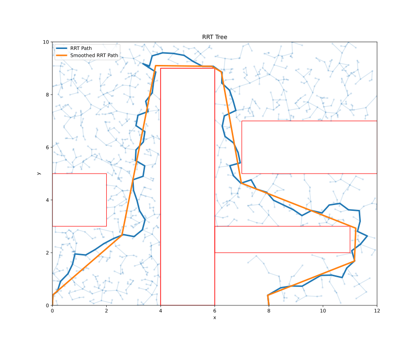
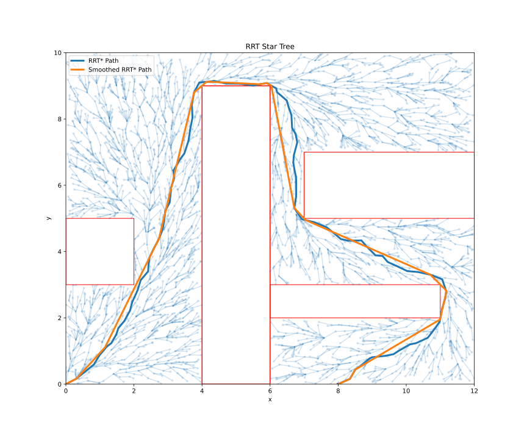

# MERCI RRT Path Planners
Implementations of RRT-based algorithms used in [GRAIC 2.0](https://popgri.github.io/Race/outreach/) Competition by team 
MERCI (MEthodological Racing Computer Intelligence). **MERCI placed 1st in the Head-to-Head category.**

| Rapidly Exploring Random Tree (RRT)    | RRT*                                            |
|----------------------------------------|-------------------------------------------------|
|  |  |

## Overview
The RRT implementations are designed for 2D vehicle racing, containing

* Planners
    * Rapidly Exploring Random Trees (RRT)
    * RRT*
    * [TODO] Kinematic RRT
        * Dubins Path
    * [TODO] Dynamic RRT
        * LQR RRT?
* Obstacles
    * Circles
    * Rectangles 
    * Convex Polygons 
    * Parallel Curves 
* Smoothers
    * Random Path Smoothing (obstacle aware)
* Samplers
    * Uniform
    * [TODO] Sobol

## Benchmarks

We have a crude [benchmarks](./notebooks/rrt-benchmark.ipynb) notebook. We see that for RRT implementations, MerciPy achieves planning **10s to 100s of times faster than an existing python implementation**.

## References 

Algorithms were taken from their respective papers. Also, Pythonrobotics implementations were referenced.

### PythonRobotics
> Sakai, A., Ingram, D., Dinius, J., Chawla, K., Raffin, A., & Paques, A. (2018). Pythonrobotics: a python code collection of robotics algorithms. arXiv preprint arXiv:1808.10703.

### RRT
> LaValle, S. M., & Kuffner Jr, J. J. (2001). Randomized kinodynamic planning. The international journal of robotics research, 20(5), 378-400.

### RRT*
> Karaman, S., & Frazzoli, E. (2011). Sampling-based algorithms for optimal motion planning. The international journal of robotics research, 30(7), 846-894.

## Python Bindings

See the [mercipy](./mercipy) folder.
